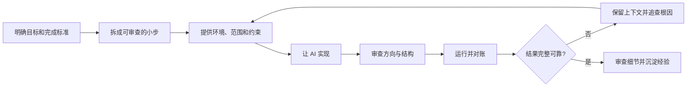

+++
author = "Binwei Wu"
title = "AI workbrain coding lessons learned"
date = "2026-10-01"
description = "AI workbrain coding lessons learned"
featured = true
tags = [
    "ai"
]
categories = [
    "Engineering",
]
series = "2026"
aliases = ["migrate-from-jekyl"]

+++

从 2026 年 7 月下旬开始，我在真实项目、个人工具和日常问题中密集使用 AI。最重要的结论不是“AI 能不能写代码”，而是：**如何建立一套协作流程，把 AI 的生成速度转化为可靠结果。**

> [!abstract] 核心结论
> AI 擅长探索、生成和迭代，却不会自动理解真实目标、系统边界与完成标准。人的工作正在从“亲手写每一行代码”，转向“拆解问题、提供上下文、控制范围、验证结果和沉淀知识”。

## 1. 小步推进，而不是一次生成大量代码

一次生成大量代码看似高效，却容易引入不必要的抽象、隐藏逻辑和失控范围。代码越多，人越难审查，AI 也越难在后续修改中保持一致。原型可以容忍这种方式，生产代码则承担不起隐藏的复杂度。

更可靠的做法是：

1. 明确本轮只解决一个问题。
2. 限制允许修改的文件和行为。
3. 完成后立即查看差异并运行验证。
4. 确认没有扩大范围，再进入下一步。

小步推进不会降低速度，反而能减少清理冗余代码、定位回归问题和重建上下文的成本。

## 2. 审查顺序比审查强度更重要

如果一开始就逐行检查细节，很可能把时间浪费在最终会被整体推翻的实现上。更有效的方法是分层审查：

- **方向层**：需求是否理解正确，方案是否解决了真正的问题？
- **结构层**：职责、数据流、依赖和错误处理是否合理？
- **细节层**：边界条件、命名、重复代码、测试和性能是否达标？

发现方向或结构问题时，应先修正再继续深入。人的注意力有限，应优先用于 AI 最难替代的判断，而不是平均分配给每一行代码。

## 3. 把“完成”定义为结果经过验证

AI 生成了代码，只代表实现开始了，不代表任务已经完成。一个任务至少要满足以下条件：

- 实现已经落盘；
- 关键路径已经实际运行；
- 结果已经与预期对账；
- 异常和边界情况已经检查；
- 必要的测试、说明或后续事项已经留下。

在这些步骤完成前，应尽量保留原会话。持续参与实现的会话知道之前的修改、尝试和限制；过早关闭会话，会迫使人重新构建上下文。对于较长任务，还应把关键决策写入代码、测试或笔记，避免重要信息只存在于聊天记录中。

## 4. 明确环境、范围和验收标准

制作飞书笔记备份工具时，AI 起初没有意识到自己运行在无头浏览器中。补充环境信息后，工具虽然备份了大部分笔记，却因直接采用汇总页、没有递归处理子笔记而遗漏内容。直到核对数量并追查根因，问题才被发现。

这个案例说明，“程序能跑”不等于“任务完成”。给 AI 的任务描述至少应包含：

- **运行环境**：权限、网络、浏览器模式、内部工具和部署限制；
- **覆盖范围**：是否需要分页、递归、重试和处理嵌套结构；
- **完成标准**：数量是否一致、如何对账、允许多少失败；
- **验证方式**：如何证明没有遗漏，而不只是处理过一部分。

AI 容易完成最显眼的主路径，却不会天然理解业务上“一条都不能漏”。

## 5. 用真实证据弥补领域知识缺口

生产问题往往不只来自代码，还涉及授权、部署环境、数据完整性、内部流程和基础设施限制。即使代码逻辑正确，也可能因网络、隧道或测试环境等约束而无法验证。

现实生活中的问题同样如此。现场维修涉及设备状态、责任边界和服务流程，AI 的通用答案可能与实际情况相差很大。AI 可以提供排查方向，但最终判断仍要依赖日志、代码、运行结果、现场证据和熟悉系统的人。

因此，AI 时代的技术护城河依然存在，主要体现在：

- 知道去哪里寻找可靠证据；
- 知道系统通常会在哪里出问题；
- 能判断建议是否适用于当前环境；
- 能把一次排障沉淀为可复用的经验。

## 6. 管理并行度和工作节奏

多个 AI 会话可以并行推进相互独立的任务，减少等待时间，但前提是任务边界清晰：

- 修改范围相互独立；
- 输入和验收标准明确；
- 不依赖频繁共享的中间状态；
- 每个会话都有清楚的任务和责任边界。

AI 增加了可同时开展的工作数量，但人的审核能力和注意力没有同步增长。并行过多时，人会成为上下文切换的瓶颈。

低风险、高反馈的日常任务适合用来练习协作，例如清理数据、排查设备问题或制作个人备份工具。这些任务失败成本较低，结果容易核对，可以训练目标描述、环境补充、错误假设识别和验收设计等能力。

同时，AI 也容易让人陷入“还可以再做一点”的状态。真正可持续的效率，不是让 AI 把工作无限塞满，而是减少机械劳动，把人的精力留给判断、学习和恢复。

## 一套可复用的协作流程

每次使用 AI 开发时，可以检查：

- 是否说明了真实目标，而不只是要求执行一个动作？
- 任务是否足够小，能够理解全部改动？
- AI 是否知道环境、限制和不可修改的边界？
- 验证的是“程序运行了”，还是“业务结果完整且正确”？
- 是否检查了分页、递归、权限、异常和数据遗漏？
- 关键决策是否已经写入代码、测试或文档？
- 是否保留了足够的精力进行最终判断？

## 结语

AI 的价值不是代替工程师写更多代码，而是缩短从想法到实验、从问题到证据、从失败到下一轮迭代的距离。与此同时，它也会放大模糊需求、失控范围、验证不足和领域知识缺失。

最终决定结果质量的，仍然是人能否提出正确的问题、建立明确边界、识别不可靠的答案，并用真实证据完成最后一公里。AI 是能力放大器，既能放大工程纪律，也能放大混乱。

BTW, this blog content is generated from my daily notes.

*Written by Binwei@Shanghai*